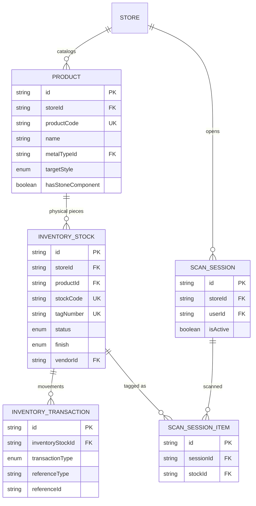
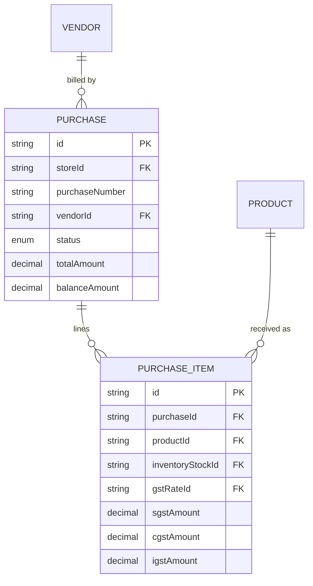
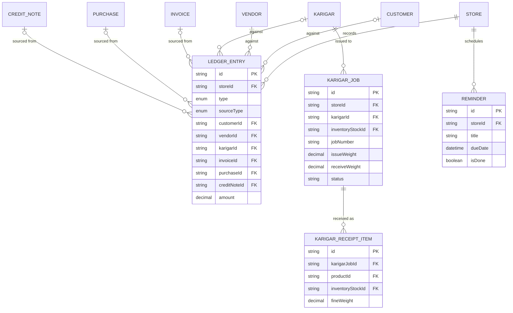
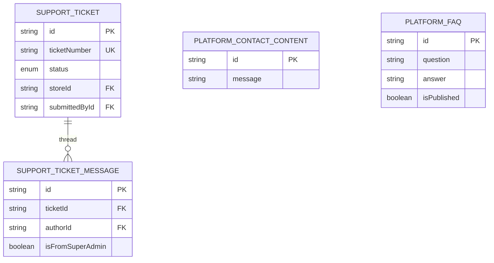

# Database Schema — Entity Relationship Reference

Source of truth: `prisma/schema.prisma`. Every business record carries a
`storeId` — `Store` is the tenant root everything else hangs off. This doc
groups the schema's 61 models into eight domains so the relationships are
readable at a glance. Diagrams show primary/foreign keys and cardinality,
not every column — open `prisma/schema.prisma` for exact types and the doc
comments behind each design decision.

Update this file directly (and re-render the diagrams below) whenever a
migration changes a relationship — same "keep it current" convention as
`CLAUDE.md`.

**Legend:** `||--o{` one-to-many · `|o--o{` optional (nullable FK) to many ·
`|o--o|` optional one-to-one · `PK` primary key · `FK` foreign key ·
`UK` unique.

## Contents

1. [Tenancy & Access](#1-tenancy--access)
2. [Taxonomy & Settings](#2-taxonomy--settings)
3. [Parties](#3-parties)
4. [Catalog & Inventory](#4-catalog--inventory)
5. [Sales Documents](#5-sales-documents)
6. [Purchasing](#6-purchasing)
7. [Ledger & Karigar Jobs](#7-ledger--karigar-jobs)
8. [Platform & Support](#8-platform--support)
9. [Shared enums](#9-shared-enums)

---

## 1. Tenancy & Access

`Store` is the tenant boundary; everything else in this domain resolves who
can act on it. A person's login (`User`) is globally unique on email/phone
(NextAuth + OTP both look it up that way) — multi-store access is a
separate `UserStoreMembership` row per store, not a duplicated User.

```mermaid
erDiagram
  PLAN ||--o{ STORE : "subscribes"
  STORE ||--o{ STORE_PLAN_HISTORY : "records"
  STORE ||--o{ STORE_LOCATION : "has"
  STORE ||--o{ USER : "employs"
  STORE ||--o{ USER_STORE_MEMBERSHIP : "grants"
  USER ||--o{ USER_STORE_MEMBERSHIP : "holds"
  USER ||--o{ USER_LOCATION_ACCESS : "restricted to"
  STORE_LOCATION ||--o{ USER_LOCATION_ACCESS : "grants"
  STORE ||--o{ INVITE_TOKEN : "issues"
  USER ||--o{ INVITE_TOKEN : "invitedBy"
  STORE ||--o{ API_KEY : "issues"
  USER ||--o{ API_KEY : "createdBy"
  USER ||--o| EMPLOYEE : "profile"
  USER ||--o{ ACCOUNT : "oauth"
  USER ||--o{ SESSION : "sessions"
  USER ||--o{ OTP_CODE : "otp"

  STORE {
    string id PK
    string code UK
    string planId FK
    string defaultLocationId FK
    boolean isActive
  }
  PLAN {
    string id PK
    string name
    int durationDays
    decimal price
  }
  STORE_PLAN_HISTORY {
    string id PK
    string storeId FK
    string planId FK
    enum action
    datetime startedAt
    datetime expiresAt
  }
  STORE_LOCATION {
    string id PK
    string storeId FK
    string name
    boolean isActive
  }
  USER {
    string id PK
    string email UK
    string phone UK
    string storeId FK
    string karigarId FK
    enum role
    enum status
  }
  USER_STORE_MEMBERSHIP {
    string id PK
    string userId FK
    string storeId FK
    enum role
    string_array permissions
  }
  USER_LOCATION_ACCESS {
    string id PK
    string userId FK
    string locationId FK
  }
  INVITE_TOKEN {
    string id PK
    string tokenHash UK
    enum role
    string storeId FK
    string invitedById FK
  }
  API_KEY {
    string id PK
    string storeId FK
    string keyHash UK
    string_array permissions
    boolean isRevoked
  }
  EMPLOYEE {
    string id PK
    string userId FK UK
    string employeeCode UK
  }
  ACCOUNT {
    string id PK
    string userId FK
    string provider
  }
  SESSION {
    string id PK
    string sessionToken UK
    string userId FK
  }
  OTP_CODE {
    string id PK
    string userId FK
    enum purpose
    datetime expiresAt
  }
```

- **`User.storeId`/`role`/`permissions`** — legacy single-store fields,
  still the fallback for accounts that predate `UserStoreMembership`. A
  membership row wins when present.
- **`User.karigarId`** — 1:1 to `Karigar` (Parties domain) — how a
  KARIGAR-role login resolves to "only see my own jobs."

---

## 2. Taxonomy & Settings

The store-configurable vocabulary every transactional document draws from —
metals/stones, categories, GST rates, and the per-store settings singleton.
`StoreMetal` covers both plain metals and gemstones (`isGemstone`) through
one table and one FK everywhere else in the schema.

```mermaid
erDiagram
  STORE ||--o{ STORE_METAL : "defines"
  STORE_METAL ||--o{ STORE_METAL_ORIGIN : "stone types"
  STORE ||--o{ STORE_CATEGORY : "defines"
  STORE_CATEGORY ||--o{ STORE_CATEGORY_TYPE : "types"
  STORE ||--o{ PURITY_FINENESS : "configures"
  STORE ||--o{ CARAT_CONVERSION_RATE : "configures"
  STORE ||--o{ METAL_SELLING_RATE : "configures"
  STORE ||--o{ GST_RATE : "defines"
  STORE ||--o| BUSINESS_SETTINGS : "configures"
  STORE ||--o{ METAL_RATE : "logs"
  STATE ||--o{ CITY : "contains"

  STORE_METAL {
    string id PK
    string storeId FK
    string name
    boolean isGemstone
    enum primaryUnit
    decimal sellingPrice
  }
  STORE_METAL_ORIGIN {
    string id PK
    string storeMetalId FK
    string name
  }
  STORE_CATEGORY {
    string id PK
    string storeId FK
    string name
  }
  STORE_CATEGORY_TYPE {
    string id PK
    string categoryId FK
    string name
  }
  PURITY_FINENESS {
    string id PK
    string storeId FK
    enum purity
    decimal finenessPercent
  }
  CARAT_CONVERSION_RATE {
    string id PK
    string storeId FK
    enum purity
    decimal gramsPerCarat
  }
  METAL_SELLING_RATE {
    string id PK
    string storeId FK
    enum purity
    decimal sellingPrice
  }
  GST_RATE {
    string id PK
    string storeId FK
    string name
    decimal ratePercent
    boolean isDefault
  }
  BUSINESS_SETTINGS {
    string storeId PK_FK
    enum gstScheme
    enum skuFormat
    decimal hallmarkChargePerPiece
    int returnWindowDays
  }
  METAL_RATE {
    string id PK
    string storeId FK
    decimal gold22k
    decimal silver
  }
  STATE {
    string id PK
    string name UK
    string isoCode UK
  }
  CITY {
    string id PK
    string stateId FK
    string name
  }
```

- **`GstRate`** — Invoice picks this per line item (mixed rates on one
  document); Purchase and Quotation still pick one rate per whole document.
- **`BusinessSettings`** — singleton per store (PK = `storeId`) — business
  identity, tax scheme, invoice numbering, bank details, return-window
  policy.

---

## 3. Parties

The three counterparty types a store transacts with. A `Customer` and a
`Vendor` can optionally be linked as the same real person/business (someone
who both buys and sells old gold back) while each keeps its own
independent invoices, purchases, and ledger.

```mermaid
erDiagram
  STORE ||--o{ CUSTOMER : "has"
  STORE ||--o{ VENDOR : "has"
  STORE ||--o{ KARIGAR : "has"
  KARIGAR ||--o{ KARIGAR_METAL : "assigned"
  CUSTOMER |o--o| VENDOR : "linkedVendor (optional)"

  CUSTOMER {
    string id PK
    string storeId FK
    string customerCode
    string name
    string phone
    enum gstType
    string linkedVendorId FK_UK
  }
  VENDOR {
    string id PK
    string storeId FK
    string vendorCode
    string name
    enum gstType
  }
  KARIGAR {
    string id PK
    string storeId FK
    string code
    string name
    string metalTypeId FK
    string locationId FK
  }
  KARIGAR_METAL {
    string id PK
    string karigarId FK
    string metalTypeId FK
  }
```

- **`Karigar.metalTypeId`** — single "mainly works with" label for list
  filtering — `KarigarMetal` is the real gate on which metals a job can be
  raised in.
- **`gstType`** — the party's own GST registration status (`PartyGstType`)
  — independent of the store's own `BusinessSettings.gstScheme`.

---

## 4. Catalog & Inventory

`Product` is a design/SKU; `InventoryStock` is one physical piece of it,
with its own weights/rates since two rings off the same design are never
identical to the milligram. `InventoryTransaction` is the movement log per
piece.



- **`InventoryTransaction.reference*`** — polymorphic pointer (type + id)
  at whatever document moved this stock — Invoice, Purchase, KarigarJob, an
  adjustment.
- **`ScanSession`** — bridges a laptop billing screen and a phone scanner
  across separate requests — expires so an abandoned tab can't swallow a
  scan days later.

---

## 5. Sales Documents

Four independent document types, each with its own numbering series: the
GST `Invoice` (Tax Invoice), the GST-free `KachaInvoice` (Estimate),
`Quotation`, and `DraftOrder` (a made-to-order piece routed through a
Karigar job before it exists as stock). A `CreditNote` is a return against
a paid/partial Invoice — its own document, never a mutation of the
original.

```mermaid
erDiagram
  CUSTOMER ||--o{ INVOICE : "billed to"
  INVOICE ||--o{ INVOICE_ITEM : "lines"
  INVOICE ||--o{ CREDIT_NOTE : "returned via"
  CREDIT_NOTE ||--o{ CREDIT_NOTE_ITEM : "lines"
  INVOICE_ITEM ||--o{ CREDIT_NOTE_ITEM : "returns"
  INVOICE |o--o| INVOICE : "replaces"

  CUSTOMER ||--o{ KACHA_INVOICE : "billed to"
  KACHA_INVOICE ||--o{ KACHA_INVOICE_ITEM : "lines"
  KACHA_INVOICE |o--o| INVOICE : "convertedTo"

  CUSTOMER ||--o{ QUOTATION : "quoted to"
  QUOTATION ||--o{ QUOTATION_ITEM : "lines"
  QUOTATION |o--o| INVOICE : "convertedTo"

  CUSTOMER ||--o{ DRAFT_ORDER : "ordered by"
  DRAFT_ORDER ||--o{ DRAFT_ORDER_ITEM : "lines"
  DRAFT_ORDER |o--o| KARIGAR_JOB : "fulfilled via"
  DRAFT_ORDER_ITEM |o--o| KARIGAR_RECEIPT_ITEM : "matched to"

  INVOICE {
    string id PK
    string storeId FK
    string invoiceNumber
    string customerId FK
    enum status
    decimal totalAmount
    decimal balanceAmount
    string replacesId FK_UK
  }
  INVOICE_ITEM {
    string id PK
    string invoiceId FK
    string inventoryStockId FK
    string gstRateId FK
    decimal sgstAmount
    decimal cgstAmount
    decimal igstAmount
  }
  CREDIT_NOTE {
    string id PK
    string invoiceId FK
    string customerId FK
    decimal totalAmount
  }
  CREDIT_NOTE_ITEM {
    string id PK
    string creditNoteId FK
    string invoiceItemId FK
    int quantity
  }
  KACHA_INVOICE {
    string id PK
    string slipNumber
    string customerId FK
    string convertedToId FK_UK
  }
  KACHA_INVOICE_ITEM {
    string id PK
    string kachaInvoiceId FK
  }
  QUOTATION {
    string id PK
    string quotationNumber
    string customerId FK
    string gstRateId FK
    string convertedToId FK_UK
  }
  QUOTATION_ITEM {
    string id PK
    string quotationId FK
  }
  DRAFT_ORDER {
    string id PK
    string orderNumber
    string customerId FK
    enum status
    string karigarJobId FK_UK
  }
  DRAFT_ORDER_ITEM {
    string id PK
    string draftOrderId FK
    string karigarReceiptItemId FK_UK
  }
```

- **`InvoiceItem.gstRateId`** — GST resolved per line — a single invoice
  can mix a 3% metal line with an 18% making-charge line.
- **`CreditNoteItem`** — no "remaining quantity" counter on InvoiceItem — a
  second return is capped by summing prior CreditNoteItem rows against the
  same line, so nothing can drift out of sync.
- **`DraftOrder` ↔ `KarigarJob`** — one order to at most one job in this
  pass — pooling several orders into one job is out of scope.

---

## 6. Purchasing

A bill from a `Vendor`. GST here reflects whatever the vendor actually
charged (their own `gstType`), never the store's own scheme — the
counterpart to Sales Documents on the buy side.



- ITC on any purchase line defaults to BLOCKED app-wide until GSTR-2B
  reconciliation (IMS) exists — an intentional gap, see `CLAUDE.md`.

---

## 7. Ledger & Karigar Jobs

`LedgerEntry` is the one place every balance-affecting event lands — sales,
purchases, payments, karigar issue/receipt, manual adjustments — each
optionally pointing at whichever party and source document produced it.
`KarigarJob` tracks metal issued to an artisan through to what came back.



- **`LedgerEntry.sourceType`** — `PAYMENT_IN`/`PAYMENT_OUT` are the actual
  cash-movement rows, kept distinct from `SALE`/`PURCHASE`'s balance-due
  accrual rows so Payments pages can filter by a plain match, not a
  heuristic.

---

## 8. Platform & Support

The only models in the schema without a `storeId` — platform-operator
content and support shown identically across every tenant, editable only
by `SUPER_ADMIN`.



- **`SupportTicket.storeId`** — optional, not the mandatory scoping FK
  every other model carries — a ticket is visible to every Super Admin
  regardless of origin, including an anonymous public-site submission.

---

## 9. Shared enums

| Enum | Values |
|---|---|
| `UserRole` | `SUPER_ADMIN`, `ADMIN`, `MANAGER`, `STAFF`, `KARIGAR` |
| `UserStatus` | `INVITED`, `ACTIVE`, `DISABLED` |
| `InvoiceStatus` | `DRAFT`, `PAID`, `PARTIAL`, `CANCELLED` |
| `PartyGstType` | `UNREGISTERED`, `REGULAR`, `COMPOSITION` |
| `GstScheme` | `REGULAR_B2C`, `REGULAR_B2B`, `COMPOSITION` |
| `PurityType` | `GOLD_18K`, `GOLD_20K`, `GOLD_22K`, `GOLD_24K`, `SILVER_925`, `SILVER_999`, `PLATINUM_900`, `PLATINUM_950`, `DIAMOND`, `OTHER` |
| `WeightUnit` | `GRAM`, `CARAT` |
| `InventoryStockStatus` | `IN_STOCK`, `SOLD`, `RESERVED`, `ISSUED_TO_KARIGAR`, `DAMAGED`, `ARCHIVED` |
| `InventoryFinish` | `KACHA`, `PAKKA` |
| `InventoryTransactionType` | `OPENING`, `PURCHASE`, `SALE`, `SALE_RETURN`, `KARIGAR_ISSUE`, `KARIGAR_RECEIPT`, `ADJUSTMENT`, `DAMAGE`, `RESERVE`, `UNRESERVE` |
| `LedgerEntryType` | `CREDIT`, `DEBIT` |
| `LedgerSourceType` | `MANUAL`, `SALE`, `SALE_RETURN`, `PURCHASE`, `KARIGAR_ISSUE`, `KARIGAR_RECEIPT`, `ADJUSTMENT`, `PAYMENT_IN`, `PAYMENT_OUT` |
| `PaymentMethod` | `CASH`, `UPI`, `NET_BANKING`, `CHEQUE`, `CARD`, `OTHER` |
| `ChargeType` | `FIXED`, `PERCENTAGE` |
| `TargetStyle` | `LADIES`, `GENTS`, `KIDS`, `UNISEX` |
| `SkuFormat` | `METAL_PURITY_STYLE_CATEGORY`, `METAL_CATEGORY_PURITY`, `CATEGORY_METAL_PURITY`, `STYLE_CATEGORY_METAL_PURITY` |
| `TransportMode` | `ROAD`, `RAIL`, `AIR`, `SHIP` |
| `TicketStatus` | `OPEN`, `IN_PROGRESS`, `RESOLVED`, `CLOSED` |
| `OtpPurpose` | `LOGIN`, `PHONE_VERIFY`, `PROFILE_PHONE_CHANGE`, `PROFILE_EMAIL_CHANGE` |
| `StorePlanAction` | `REGISTERED`, `ASSIGNED`, `RENEWED` |

---

Fields shown in the diagrams above are a representative subset (id/PK/FK/
status/amount columns) chosen for readability — `prisma/schema.prisma` is
authoritative for exact types, defaults, and the doc comments behind each
decision.
